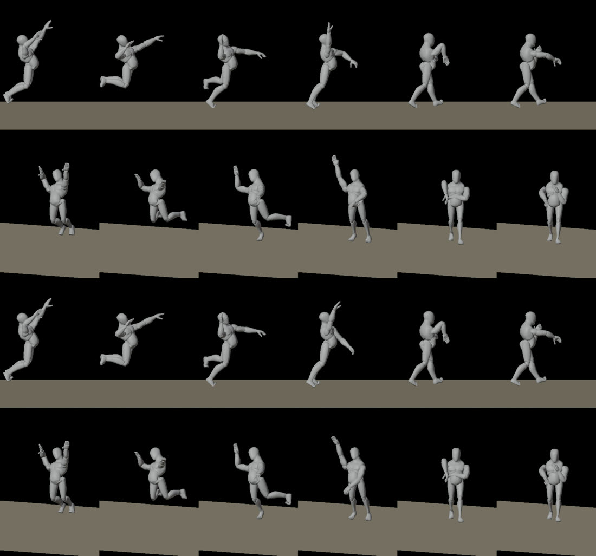
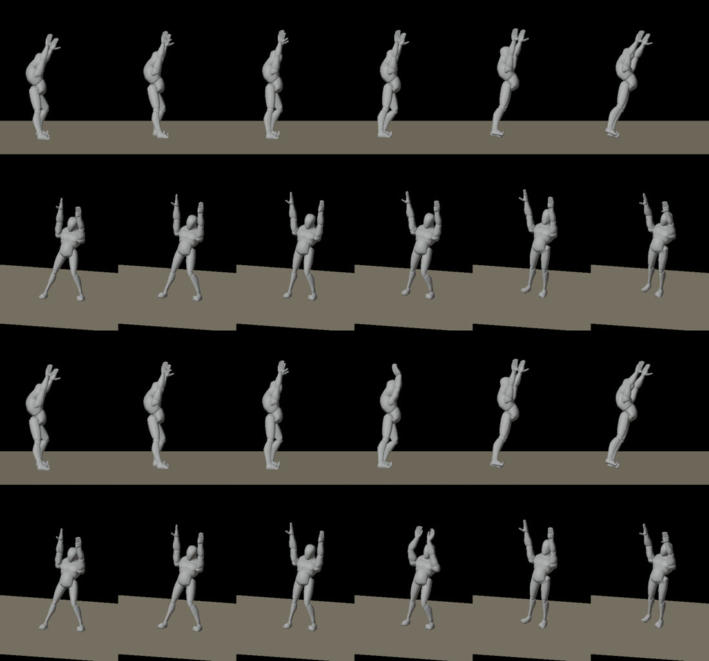

# Animation experiments

Each experiment changes one thing, measures it against the one before on the
same bot match, and records what we decided. Ideas and sources are in
[research.md](research.md); how to run the measurements is in the
[README](README.md).

## How we measure

`python3 tools/bench.py run NAME` plays the same 90-second bot match three
times in bench mode (`crates/client/src/bench.rs`) and writes
`bench/NAME-N.json`; `python3 tools/bench.py compare A B` puts two experiments
side by side. Bots and the simulation are deterministic, so every run has the
same touches; what differs between runs of one build is measurement noise
(when in each frame a touch lands), shown as ±.

- **Contact gap:** at each touch, the distance from the toucher's nearest
  palm (middle knuckle) or toes to the ball's surface, as drawn. 0 is a hand
  on the ball. Reported by kind of hit; `Pass` covers bumps and sets.
- **Swing timing:** for wound-up hits, how far the clip was from its contact
  frame when the ball was touched (clip seconds), and how far the body was
  slid to meet it.
- **Frame time:** mean, p95, p99. macOS keeps vsync on whatever the game asks,
  so the mean sits at 16.7 ms on a 60 Hz display; p95 and p99 show hitches.
  It depends on the machine's state (another heavy program, heat after a
  long session), so compare frame times only between runs made back to back,
  alternating the builds.
- **Hit-stop:** each touch's launch speed and how long the game froze for it.
- **What the numbers miss:** how a pose reads. The gap measures where the
  hand is, not whether the arm looks right, and some correct technique scores
  worse (a set's wrists bend back, which lowers the knuckle it measures). So
  each experiment also gets a visual check: Blender contact sheets
  (`retarget_mocap.py --preview`), and in-game shots with
  `VOLLEY_BENCH_SHOTS=dir`. In-game shots need the screen awake and unlocked;
  a locked Mac draws nothing.

## 01 · Baseline (2026-10-06)

The game as of the source-assets move: the set, serve and spike tracked from
video with DeepMotion, timed swings, root warp, arm IK, pass reach up to
2.15 m, serves launched as the swing reaches the ball.

| Contact gap (m) | mean | median |
|---|---|---|
| All | 0.168 ±0.004 | 0.175 ±0.006 |
| Pass (bump, set) | 0.192 ±0.010 | 0.213 ±0.016 |
| Spike | 0.080 ±0.008 | 0.099 ±0.014 |
| Serve | 0.036 ±0.000 | 0.007 ±0.001 |
| Curve (banana kick) | 0.263 ±0.016 | 0.276 ±0.009 |

Every wound-up swing was timed to its touch, landing within 0.002 s of its
contact frame. Frames: 16.76 ms mean, 20.6 p95, 23.1 p99. Earlier fixes show
here: the serve's palm meets the ball (the swing used to arrive 0.2 s late),
and sets no longer reach over the fingertips.

## 02 · Hand-keyed contact accents on the spike and set

**Idea.** Captures soften the big moments: actors don't really hit, and video
tracking smooths the fastest motion. The tracked spike reached contact with
the arm straight up by the ear and the free arm hanging, the most common way
a spike looks wrong; the tracked set held the hands wide apart, one high and
one low. Studios push mocap with a hand-keyed layer at contact (Sifu,
Assassin's Creed III, Lethal League's hand-picked poses; see research.md).

**How.** `retarget_mocap.py` gained `accent`: a pose solved with the rig's arm
IK and blended over the capture, easing in before the contact frame and out
after, with targets measured from the body each frame so the pose rides along
with the capture. The poses follow volleyball biomechanics:

- **Spike** (contact at 0.82 s): the hitting wrist 0.5 m above, 0.22 m in front
  of and 0.1 m outside the shoulder, elbow out and back (about 130° from the
  side, arm in front of the shoulder line), wrist starting to snap; the free
  arm pulled down across the body. In over 0.12 s, no hold, out over 0.06 s,
  so the capture's whip (14 m/s) follows straight after contact.
- **Set** (contact at 1.05 s): see 03 and 04 for where the hands ended up.

**Result.** The first set pose put the hands at forehead height from the
paper's numbers (27 cm above and 18 cm in front of the forehead for the
ball): passes got clearly worse, 0.192 → 0.228 ±0.010 m. The game's sets meet
balls about 2 m up, and that pose held the palms at 1.78 m against the
capture's 1.86. Spikes didn't change measurably (0.080 → 0.089 ±0.013): the
accent changes how the arm looks, not where the hand meets the ball.

At contact (fourth column) the arm now reaches forward and out in front of the
shoulder instead of straight up, and the free arm pulls down across the body.

## 03 · Set window at the captured height

**Idea.** Raising the set pose's hands didn't work: at a window narrower than
the shoulders, these arms are already fully stretched. So the accent shouldn't
choose the height, only the shape: bring the hands together where the capture
holds them (`base="hands"`), wrists bent back 55°, elbows out.

**Result.** Passes 0.221 ±0.004 m: better than 02, still above the baseline.

## 04 · Set ball spot on the new hands

**Idea.** The set's `Swing` ball spot (where the body is slid to so the ball
meets the hands) was still 18 cm in front; the reshaped hands are 8–10 cm in
front, so the ball landed ahead of them. Moved to `spot(-0.09, 0.1, 1.92)`.

**Result.** Passes 0.207 ±0.007 m against the baseline's 0.192 ±0.010: about
the noise. Spikes 0.094 ±0.023, within noise of the baseline. Frame times
unchanged.

**Decision: keep 04.** Both hits now pose like the real technique at contact
at no measurable cost to contact accuracy. What's left of the set's gap comes
from the measurement (bent-back wrists lower the knuckle) and from balls taken
high.

**Still to do:**
- In-game before/after shots, with the screen unlocked:
  `VOLLEY_BENCH=/tmp/b.json VOLLEY_BENCH_SHOTS=/tmp/shots cargo run -p volley_client`.
- Playtest questions: can you tell the moment of contact? spike from set
  before contact?

## 05 · Hit-stop that grows with the hit

**Idea.** The game froze for a fixed 30–80 ms on any attack (more for a clean
one), and not at all for serves. In Lethal League the pause grows with the
ball's speed, so harder hits feel heavier; in Smash the hitter shakes through
the freeze, which sells the impact without freezing longer; sets should stay
soft (research.md).

**How.** `feel.rs`: a hit freezes 6 ms for each m/s the ball leaves faster than
10 m/s, capped at 120 ms; attacks scale that by how clean they were
(0.5 + 0.5 × quality). The hitter shakes during the freeze, 5 cm at first and
fading, across the body on the ground and up and down in the air. The bench
now records each touch's launch speed and freeze (`hit_stop` in the JSON).

**Result** (launch speeds are the same in both; freezes per hit):

| Hit | Launch speed | Freeze before | Freeze after |
|---|---|---|---|
| Pass (bump, set) | 8.1 m/s (max 11.5) | none | 1 ms (max 9) |
| Serve | 19.0 m/s | none | 54 ms |
| Spike | 23.1 m/s (max 24.6) | 79 ms | 78 ms (max 85) |
| Banana kick | 25.4 m/s (max 28.3) | 80 ms | 93 ms (max 110) |

Contact accuracy is unchanged within noise. Frame times: the three bench runs
came out slow (28.5 ±8 ms mean), but that was the machine, not the change. Run
interleaved with the previous build, old and new matched (20.0 against
19.1–19.4 ms), both slower than earlier in the session. **Lesson:** compare
frame times only between runs made back to back, alternating builds.

**Decision: keep.** Spikes keep their weight; serves gain an impact; soft
touches stay soft; the hardest kicks hit hardest. How it feels needs a
playtest: does a spike feel heavier than a serve, and a set soft?

## 06 · Inertialization

**Idea.** Every switch into or out of a hit crossfades over 150 ms: both clips
play at partial weight, so a dig or spike starts in a smear of the two poses.
Inertialization (Gears of War 4, Bollo, GDC 2018) cuts to the new clip at
full weight and carries the old pose's difference as an offset that fades out:
the new motion shows from the first frame, and one clip plays at a time.

**How.** `crates/client/src/inertia.rs`: right after Bevy applies the
animation, each bone's offset from the last shown pose is taken at a cut and
faded over the blend time (`1 - smoothstep`), the hair skeleton included.
Gait changes still crossfade, so strides line up. The bench gained a pop
measure: every palm's speed each frame (a pop is an impossible speed), and
`tools/bench.py run A B` now alternates variants run by run, so both share the
machine's state; `NAME:VAR=VALUE` sets an environment variable per variant.

**Result** (06-crossfade against 06-inertia, alternating, same build):

| | Crossfade | Inertialization |
|---|---|---|
| Gap, passes (m) | 0.203 ±0.008 | 0.210 ±0.022 |
| Gap, spikes (m) | 0.088 ±0.021 | 0.125 ±0.034 |
| Gap, banana kicks (m) | 0.238 ±0.022 | 0.285 ±0.035 |
| Frames with a palm over 30 m/s | 68 ±3 | 52 ±11 |
| Frame time (ms) | 18.95 | 18.92 |

## 07 · Inertialization, fading fast

**Idea.** The smooth fade keeps 78% of the old pose 30% of the way through, so
a hit cut into just before contact may not reach its pose in time. A fade that
drops fast at first, `(1 - x)³`, like Holden's dead blending.

**Result** (07-crossfade against 07-inertia-fast): banana kicks still 5 cm
further from the ball (0.264 ±0.004 against 0.211 ±0.017), hands the same
within noise, and frames with a palm over 30 m/s doubled (134 against 72):
the fast start snaps the hands.

**Decision: keep crossfading.** Neither fade beat the crossfade on contact,
and Golazo's kicks got consistently worse with both; the smooth fade only
helped pops a little. The module stays, off, behind `VOLLEY_BLEND=inertia`, to
try again for specific transitions (for instance into digs, which aren't
timed to contact). Why the kicks suffer is open: kicks often switch clip at
the very touch (a low kick turning into a volley), which may be where the
offset matters.

**Found along the way:** in every run some palm moves over 350 m/s in a frame,
with or without inertialization: something teleports a hand (not a rally
reset, which the measure skips). Fixed in 08.

## 08 · Hands popping between strides

**Found.** Logging every frame where a palm moved over 40 m/s, with the clips
that had just started, showed two things:

- The 350–440 m/s jumps were whole bodies moving from the title screen's
  spots to the new match's at the start. Not visible in play; the bench now
  counts them apart, as `teleports`.
- The real pops, 0.6–0.8 m jumps of a hand in one frame, all followed the same
  pattern: a player running near the sprint speed dropped from Sprint to Jog
  and back to Sprint about 0.1 s later. Bevy's `AnimationTransitions::play`
  restarts the clip it switches to, so the sprint still fading out mid-stride
  jumped back to its first frame.

**Fix.** Switching back into a looping gait that's still playing carries on
from where it is; and a gait plays at least 0.25 s before another takes over
(`MIN_GAIT_SECONDS`), so a burst of braking and speeding up doesn't flick
between strides at all.

**Result** (old and new builds alternating, two runs each):

| | Before | After |
|---|---|---|
| Frames with a palm over 30 m/s | 70, 86 | 23, 27 |
| Frames with a palm over 40 m/s | many | 0, 2 |
| Fastest palm, bodies' teleports apart | up to 440 m/s | 39, 50 m/s |
| Contact gap, all touches (m) | 0.167, 0.171 | 0.167, 0.180 |
| Frame time (ms) | 19.3, 19.2 | 19.0, 18.9 |

The few palms still over 40 m/s are most likely swings the game speeds up (up
to 4×) to meet the ball on time, not pops. **Decision: keep.**

## 09 · Legs that run

**Found.** Starting on orientation warping, the bench gained two measures:
how fast planted feet slide (a foot on the ground should stay put) and how
often a running body faces away from where it runs. Planted feet slid at
4.3 m/s on average, at the body's whole speed while sprinting: the legs
weren't running at all. Logging what played while players moved fast on the
ground: sets (650 frames a match), the serve's follow-through as the server
runs in (342), celebrations while walking back (260), all played on the whole
body; and the standing pose for 205 frames, the 0.25 s minimum stride time
from 08 delaying the switch from standing to jogging. Only bumps and sets
could play on the upper body over running legs, and only if the player was
already running when they started.

**Fix.** In `characters.rs`:

- The serve and the cheer can play on the upper body too, and a hit already
  playing moves onto the upper body (keeping its time) as soon as the player
  runs. A serve stays whole through its hit (its hips are part of where the
  hand meets the ball) and moves only for the follow-through.
- The legs blend between strides and in and out, instead of switching in one
  frame: the hips carry the upper body, so a sudden change jumped the hands.
- A stride taking over picks up the outgoing stride's place in its cycle,
  whole body to legs only and back.
- Each one-shot clip has a twin node in the animation graph: starting a hit
  again while it's still fading out plays the twin, instead of restarting the
  fading copy at its first frame (the same jump as 08, for hits).
- The minimum stride time applies to slowing down and to jog/sprint flicks,
  counted from when a stride starts playing; speeding up is immediate.

**Result** (three runs each, alternating with the build before):

| | Before | After |
|---|---|---|
| Planted foot slide (m/s) | 4.27 | 1.67 |
| Planted foot slide, p90 (m/s) | 8.64 | 4.18 |
| Frames with a palm over 40 m/s | 1.3 | 2.0 ±2 |
| Contact gap, all touches (m) | 0.184 ±0.010 | 0.177 ±0.012 |
| Contact gap, spikes (m) | 0.120 ±0.007 | 0.095 ±0.010 |
| Frame time (ms) | 16.76 | 16.74 |

Getting here took four rounds: layering hits mid-play first brought pops
(117 frames over 30 m/s) and worse serves; each was traced with the same
logging to the cause above it. **Decision: keep.**

## 10 · Stride paces from the clips

**Idea.** The code assumes the jog and sprint look right at 4.0 and 7.0 m/s;
the retarget script measured them at 2.9 and 4.9 (about 3.1 and 5.2 on the
heroes). With the measured paces, strides play faster to match the ground.

**Result.** Planted foot slide 1.67 → 1.57 m/s, but the faster cadence pumps
the arms harder (frames with a palm over 30 m/s, 20 → 36) and looks hurried.
**Decision: revert.** What's left of the sliding needs the legs to reach
further rather than step faster: stride warping.

## 11 · Orientation warping: hips toward the run

**Idea.** 16% of running frames face more than 30° away from where the body
runs. Paragon's orientation warping turns the lower body toward the movement
while the upper body keeps its aim (research.md).

**Found first.** Logging those frames: most aren't hits wound up toward the
ball but turnarounds. A runner reversing direction takes about 0.3 s to swing
round (`TURN_SPEED`), the legs running the old way meanwhile, 115–130° off.

**How.** `twist_hips` in `characters.rs`, on the local transforms after the
animation and before they're propagated: the pelvis turns about the vertical
toward where the player runs, up to 75°, and `spine_01` and `spine_02` turn
back by half each, so the chest, arms and hits stay where they were. It
leads turnarounds too (any gap under 160°; right behind, which way to turn is
a coin toss). Only while the legs stride: with no hit playing, or a hit on the
upper body. The first version turned about the wrong axis, taking the
armature's frame for the pelvis's parent: there's a root bone between them.

**Result** (three runs each, alternating). The bench now reports the average
angle between where the hips (square to the hip joints) face and where the
body runs:

| | Before | After |
|---|---|---|
| Hips' angle from the run (average) | 18.5° | 13.5° |
| Running frames with hips over 30° off | 16.7% | 8.9% |
| Planted foot slide (m/s) | 1.64 | 1.62 |
| Contact gap, all touches (m) | 0.184 ±0.011 | 0.174 ±0.008 |
| Frames with a palm over 40 m/s | 2.0 | 1.7 |
| Frame time (ms) | 16.83 | 17.05 |

The hips' baseline (18.5°) is above the body's (14.5°) because the pelvis
sways in the stride. **Decision: keep.** It doesn't move the foot sliding
that's left: that's about how far the strides reach, not which way they go.
Not yet seen in game (the screen was locked); worth a look at a turnaround.

## 12 · Foot locking, and landings that give

**Idea.** What sliding was left after 09–11 came from strides that don't
cover the ground the body does. Breaking it down by what the body was doing
when a planted foot slid: an attack steering the body toward the ball (48%),
sprinting (25%), jogging (16%), turning (11%). No stride can match steering,
so instead of warping strides further, hold the feet: the standard fix
(Unreal's leg IK and foot placement, every sports game's "foot plant").

**How.** `lock_feet` in `characters.rs`, on the world transforms after the
pose is propagated, before the arms are posed. A foot counts as planted while
its ankle is under 0.14 m from the ground. It's held where it landed (its
height still the animation's, so the heel rolls) and the leg is solved with
two-bone IK: thigh and calf turn in the plane the knee already bends in, and
the foot keeps its world turn. Once the animation lifts it, it eases back
over 0.1 s; if the body gets more than 0.35 m away it lets go at once. Off
in the air, while stunned, and for poses that slide on purpose (kicks,
dives, slide tackles, knockdowns, foot saves).

Landings also give: the pelvis drops by how hard the body came down (0.014 m
per m/s, up to 0.1 m), quickly in and slowly out, so the knees bend and the
legs (locked to the ground) take it.

**Result** (three runs each, alternating: `bench.py ab`):

| | Before | After |
|---|---|---|
| Planted foot slide (m/s, average) | 1.61 ±0.07 | 0.90 ±0.02 |
| Planted foot slide (m/s, 90th percentile) | 4.02 ±0.20 | 2.80 ±0.05 |
| Planted frames that slide | 62% | 30% |
| Contact gap, all touches (m) | 0.181 ±0.004 | 0.191 ±0.033 |
| Frames with a palm over 40 m/s | 1.7 | 1.0 |
| Frame time (ms) | 18.4 ±1.2 | 17.6 ±0.1 |

Sliding nearly halves: since experiment 08 it's gone from 4.27 to 0.90 m/s.
What still slides is the release (the foot catching up with the animation)
and feet the bench counts as planted while they pivot. Contact is unchanged
within the noise (the spread on passes is one run). **Decision: keep.**

## 13 · The spike's follow-through

**Seen first.** A director's camera for bench films (`VOLLEY_BENCH_CAM=action`:
close and side on to whoever plays the ball next) showed what the far camera
hid: after contact the spiker's arm stops at the chest and stays there, held
out in front, for half a second until they land. The capture tracked the
whip through the ball but not its finish; trackers smooth the fastest motion.

**How.** A second hand-keyed accent in `retarget_mocap.py`, after the contact
one: from 0.15 s after contact the hitting arm is carried down across the body
to the opposite hip, the wrist snapped over, the free arm swept back by its
side, held until the clip ends. `bench.py ab` now gives each side its own
copy of the assets, so it can compare clip changes too.

**Result** (three runs each, alternating). What happens after contact isn't
something the bench measures; this checks that contact didn't move.

| | Before | After |
|---|---|---|
| Contact gap, spikes (m) | 0.118 ±0.016 | 0.136 ±0.019 |
| Contact gap, all touches (m) | 0.184 ±0.008 | 0.194 ±0.013 |
| Spike timing off (s) | 0.004 | 0.007 |
| Frames with a palm over 40 m/s | 2.0 | 1.3 |
| Frame time (ms) | 17.9 | 18.0 |

All within the noise. In the films the arm now finishes the swing and stays
down through the landing. **Decision: keep.**

## 14 · Sets that don't fold the body over

**Seen first.** In the director's films, after a set on the run the setter
bent over at the waist like a hinge, the chest level with the floor and the
arms out, for half a second. A per-frame log of every character's state
found it: torsos leaning more than 60° from upright while standing, all of
them during a set or a serve playing on the upper body over running legs.
The bench now counts these (`posture`): about 1,350 frames a match.

**Why.** Layering gives the legs, and the hips, to the stride and everything
from the spine up to the hit. The spine's pose is relative to the hips, and
in the tracked set and serve the hips are tipped far over, with the spine
bent back the other way to stand the actor up. Put that spine on running
hips, which are upright, and it folds the body over. Unreal's layered blend
has an option for this ("mesh space rotation blend").

**How.** For the set, the same idea baked into the data: `upright=True` in
`retarget_mocap.py` keeps only the hips' turn about the vertical. Each bone
is keyed by how it turns in the world, so the spine and legs keep their
world pose whatever the hips do; the hips are raised or lowered so the hip
joints stay where they were. The whole-body set looks the same, and on the
upper body it's upright. The serve was tried the same way, but leveling
moved its hand at contact 12 cm (the spine's base moves with the hips), and
the serve only layered after contact anyway, as the server ran off. So
instead the serve no longer goes onto the upper body: once a whole-body hit
is 0.1 s past contact, running cuts it short (`FOLLOW_THROUGH`), as running
already cut landings short. This also stops Golazo gliding away from a kick
serve in the kick's pose, both feet skating, for half a second.

**Result** (three runs each, alternating):

| | Before | After |
|---|---|---|
| Frames with a standing torso over 60° | 1,373 | 0 |
| Torso lean, 99th percentile | 111.5° | 35.1° |
| Contact gap, passes (m) | 0.215 ±0.019 | 0.129 ±0.013 |
| Contact gap, serves (m) | 0.038 ±0.003 | 0.048 ±0.007 |
| Contact gap, all touches (m) | 0.171 ±0.007 | 0.126 ±0.010 |
| Frames with a palm over 40 m/s | 4.3 | 2.3 |
| Frame time (ms) | 17.9 | 17.9 |

Upright, the setter's hands come up to where the ball is: pass contact is
40% closer. **Decision: keep.** The hunt also showed the bench counts a foot
as planted only under 0.14 m, while these heroes stand with their ankles at
about 0.17: foot locking (12) has been holding feet mostly during serves.
That's next.

## 15 · Feet on the floor

**Found.** Chasing why foot locking (12) barely changed running, a log of
each foot's height by clip: the clips retargeted from Mixamo float. Standing
in the ready stance the feet hover 3 cm over the floor, a jog's feet never
come closer than 7 cm, a sprint's 5 cm, the celebration's 9 cm, Cross's 15.
The tracked set and serve stand on it. The retarget puts the lowest ankle
at our rest pose's ankle height, but Mixamo's skeleton is built differently,
and its ankles never get that low. And foot locking judged a foot planted by
its ankle under 0.14 m, below where these heroes' ankles stand (0.17, on the
balls of the feet): feet were held mostly during serves.

**How.** `settle` in `retarget_mocap.py` lowers a clip until the lowest
point of its feet (ankle or ball of the foot) touches the floor as our rest
pose's does (`--heights` prints the numbers). Foot locking now judges a foot
by its lowest point, against the lowest that foot gets (its floor, which
depends on the hero), within 3 cm, and only if the animation isn't carrying
it over the ground faster than 2.5 m/s (a foot skimming low through a stride
isn't planted). Once a stride pulls a planted foot more than 0.35 m, it
eases back and isn't held again until it has lifted, instead of being held
afresh wherever it was, a jump. And a lock left over from before a new rally
(the player put somewhere else) no longer swoops the foot across the court.
The landing dip's sign was wrong in the floor test too.

**Result** (three runs each, alternating; the bench judges planted feet
the new way on both sides):

| | Before | After |
|---|---|---|
| Lowest point of the feet in a jog, closest to the floor | 7.0 cm | 1.5 cm |
| ...in the ready stance (median) | 5.2 cm | 1.9 cm |
| Held feet that move (m/s, average) | 1.33 | 0.06 |
| Planted foot slide (m/s, average) | 1.04 ±0.03 | 1.39 ±0.07 |
| Contact gap, all touches (m) | 0.119 ±0.006 | 0.118 ±0.003 |
| Frame time (ms) | 17.3 | 17.3 |

The slide average goes up because there's more to count: with the strides
off the floor, the bench never counted their feet as planted at all. Now
every stance does, and a stride's foot comes down still moving (the clips'
strides cover less ground than the body, 12). In the films the running and
standing feet meet the floor. **Decision: keep.** The bench can't tell a
foot coming down from one sliding; next would be stride warping, to make
the clips' strides as long as the ground covered.

## 16 · Stride warping

**Idea.** The jog and sprint play at the speed that looks right (`JOG_PACE`
4.0, `SPRINT_PACE` 7.0 m/s), but their strides only cover about 3.1 and
5.2 m/s: planted feet travel back under the body slower than the ground goes
by. Playing them faster pumps the arms (experiment 10); Unreal's stride
warping lengthens the strides instead.

**How.** `warp_strides` in `characters.rs`, before foot locking: while the
legs run, each foot's reach ahead of or behind the hips, along the run, is
scaled by how far short the stride falls (up to 1.35 times, eased in and
out), and the leg solved to it with the same two-bone IK.

**Result** (three runs each, alternating):

| | Before | After |
|---|---|---|
| Planted foot slide (m/s, average) | 1.59 ±0.09 | 1.38 ±0.07 |
| Planted foot slide (m/s, 90th percentile) | 4.79 ±0.10 | 4.37 ±0.02 |
| Planted frames that slide | 40% | 35% |
| Contact gap, all touches (m) | 0.147 ±0.018 | 0.119 ±0.008 |
| Frames with a palm over 40 m/s | 2.7 | 1.7 |
| Frame time (ms) | 18.8 | 18.6 |

(The "before" slides more than experiment 15's "after", the same code: runs
on different nights of the machine differ; within one A/B they alternate.)
**Decision: keep.**

## 17 · Turning on the spot steps the feet round

**Idea.** With feet held in the ready stance (15), a player turning to face
the ball keeps both feet where they were, and only a stretch past 0.35 m
would let go: the legs could twist. Games step the feet round instead.

**How.** A held foot lets go once the body has turned 35° since it was
planted (one foot at a time), eases to where the animation has it over
0.1 s, and is held again: a quick step. A foot pulled loose by a stride
likewise is held again once it has eased back, instead of only after it
lifts, which a foot in the ready stance never does. The bench now counts
standing knees pointing over 60° away from where the body faces.

**Result** (three runs each, alternating): knees off 1.4% → 1.3% of standing
legs, planted foot slide 1.45 ±0.13 → 1.38 ±0.07 m/s; contact and frame
time unchanged. The legs weren't twisting much to begin with. **Decision:
keep**, as the right behaviour for turns, measured neutral.

## 18 · Hands come up late; passes on the run let go; nobody sways in step

**Seen first.** In the films a setter runs for most of a second with both
hands over the head before the ball arrives, and again after it's gone. The
tracked set starts with the hands up (it's cut from the moment they rise),
and a pressed pass starts it at once and holds there; after contact the
clip keeps them up 0.85 s more. Players raise their hands late and drop
them as soon as the ball's away.

**How.** A bot's pass pressed early (a set or a bump) waits to start until
the ball is 0.45 s away (`LATE_HANDS`), seeked so it still reaches contact as
the ball does; meanwhile the arms keep running. Your own player's hands
still come up the moment you press, for the feedback. After contact, a pass
played on the upper body over running legs ends 0.3 s past contact
(`LAYERED_FOLLOW_THROUGH`), as whole-body hits already did (14), so the
arms drop back into the stride. And the ready stance, which everyone plays
at the start of a rally, starts at a different point of its loop for each
player and runs a few percent faster or slower, so they don't sway in step.

**Result** (three runs each, alternating):

| | Before | After |
|---|---|---|
| Contact gap, passes (m) | 0.127 ±0.021 | 0.120 ±0.007 |
| Contact gap, all touches (m) | 0.127 ±0.013 | 0.117 ±0.004 |
| Set timing off (s) | 0.012 ±0.017 | 0.002 ±0.001 |
| Frames with a palm over 30 m/s | 17.7 | 27.7 |
| Frames with a palm over 40 m/s | 2.7 | 5.7 |
| Frame time (ms) | 17.4 | 17.4 |

The cost: about three more frames a match with a hand moving over 40 m/s,
some from each of the late start and the early ending (toggled one at a time;
a longer crossfade for both didn't change it, so it isn't the blend). Logged
by clip, they're in the set's push itself. In the films the setter now runs
with the arms swinging, raises the hands just before the ball and runs off
with them down. **Decision: keep**, the snaps to look into.

## Also tonight, not measured by the bench

- **Contact shadows**: a soft dark patch under every player, shrinking and
  fading as they jump; the neon arena's light is too dim on its dark floor
  for cast shadows to ground the bodies.
- **Recoil**: a pass or dig of a ball faster than 12 m/s shoves the hips back
  along its path (up to 14 cm), with held feet, so the legs give.
- **A lost point shows**: the losing side's upper back and neck bend forward
  for two seconds, and they stop watching the ball, while the winners cheer.
- **Instant replays** of big moments (README): every step of the last four
  seconds is kept with its events and fed back in, slowed down, filmed from
  beside the player who made it.

## Next

Ranked in research.md. Seen in films and still to do: the set's push makes
a few hand snaps a match (18); Golazo's kicks swing the arms faster than
40 m/s; no anticipation before a spike's takeoff (the jump comes straight
out of the run); the serve camera looks down steeply.
